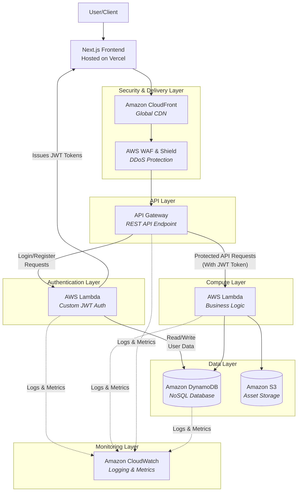

# Mini Amazon - Backend Architecture Deep Dive

## Overall System Architecture

## Data Flow Explanation

1.  **User Request**: A user interacts with the **Next.js** frontend hosted on Vercel.
2.  **Content Delivery & Security**: Requests are cached and served globally by **CloudFront**. All traffic is protected by **AWS WAF & Shield**.
3.  **API Gateway**: Dynamic API requests are routed through the **API Gateway**.
4.  **Authentication Layer**:
    *   **Login/Register Requests** (`login_user.py`, `register_user.py`) are routed to the dedicated **Auth Lambda** function.
    *   This function verifies credentials against the **UsersTable** in DynamoDB.
    *   Upon success, it **issues a signed JWT token** back to the frontend.
5.  **Business Logic Layer**:
    *   **Protected API Requests** (e.g., add to cart, create order) must include the JWT token in the header.
    *   API Gateway can be configured to use a **Lambda Authorizer** (your `auth_middleware.py`) to validate this token before allowing the request to proceed to the main **Business Logic Lambda** functions.
6.  **Data Persistence**: Lambda functions interact with **DynamoDB** for structured data and **S3** for assets like images.
7.  **Observability**: All services stream logs and metrics to **CloudWatch** for monitoring.

## Lambda Function Map

| Layer | Lambda Function | Purpose | Primary Data Source |
|-------|----------------|---------|---------------------|
| **Authentication** | `login_user.py` | Authenticate user & issue JWT | DynamoDB (UsersTable) |
| **Authentication** | `register_user.py` | Create new user account | DynamoDB (UsersTable) |
| **Authentication** | `auth_middleware.py` | Validate JWT tokens for API access | JWT Secret Key |
| **Business Logic** | `list_products.py` | Fetch product catalog | DynamoDB (ProductsTable) |
| **Business Logic** | `get_product.py` | Get single product details | DynamoDB (ProductsTable) |
| **Business Logic** | `create_product.py` | Add new product | DynamoDB (ProductsTable) |
| **Business Logic** | `update_product.py` | Modify product info | DynamoDB (ProductsTable) |
| **Business Logic** | `delete_product.py` | Remove product | DynamoDB (ProductsTable) |
| **Business Logic** | `add_to_cart.py` | Add item to cart | DynamoDB (CartTable) |
| **Business Logic** | `get_cart.py` | Retrieve cart contents | DynamoDB (CartTable) |
| **Business Logic** | `update_cart_item.py` | Modify cart item quantity | DynamoDB (CartTable) |
| **Business Logic** | `remove_from_cart.py` | Remove item from cart | DynamoDB (CartTable) |
| **Business Logic** | `create_order.py` | Process new order | DynamoDB (OrdersTable) |
| **Business Logic** | `get_orders.py` | Get user's order history | DynamoDB (OrdersTable) |
| **Business Logic** | `get_order_detail.py` | Get specific order details | DynamoDB (OrdersTable) |
| **Business Logic** | `process_payment.py` | Handle payment processing | DynamoDB (OrdersTable) |
| **Business Logic** | `generate_presigned_url.py` | Generate S3 upload URLs | S3 (Pre-signed URLs) |
| **Business Logic** | `presigned_url.py` | Handle S3 URL operations | S3 (Pre-signed URLs) |

[← Back to Main README](../README.md)
