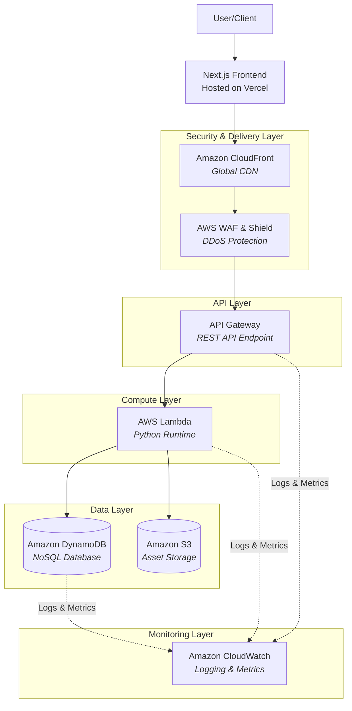

## 🏗️ Architecture Design

### Backend: AWS Serverless Stack

```mermaid
flowchart TD
    User[User/Client]
    Frontend[Next.js Frontend<br/>Hosted on Vercel]

    subgraph SecurityLayer [Security & Delivery Layer]
        CDN[Amazon CloudFront<br/><i>Global CDN</i>]
        WAF[AWS WAF & Shield<br/><i>DDoS Protection</i>]
    end

    subgraph APILayer [API Layer]
        API[API Gateway<br/><i>REST API Endpoint</i>]
    end

    subgraph ComputeLayer [Compute Layer]
        Lambda[AWS Lambda<br/><i>Python Runtime</i>]
    end

    subgraph DataLayer [Data Layer]
        DynamoDB[(Amazon DynamoDB<br/><i>NoSQL Database</i>)]
        S3[(Amazon S3<br/><i>Asset Storage</i>)]
    end

    subgraph MonitoringLayer [Monitoring Layer]
        CloudWatch[Amazon CloudWatch<br/><i>Logging & Metrics</i>]
    end

    User --> Frontend
    Frontend --> CDN
    CDN --> WAF
    WAF --> API
    API --> Lambda

    Lambda --> DynamoDB
    Lambda --> S3

    Lambda -.->|Logs & Metrics| CloudWatch
    API -.->|Logs & Metrics| CloudWatch
    DynamoDB -.->|Logs & Metrics| CloudWatch
```
